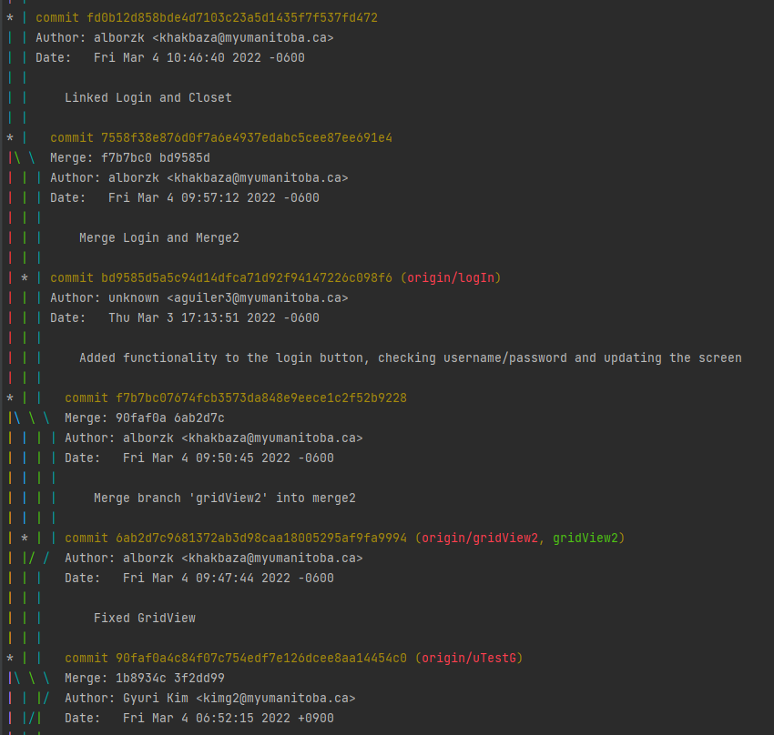

Iteration 1 Worksheet
=====================

Adding a feature
-----------------

Tell the story of how one of your features was added to the project.
Provide links to the
feature, user stories, and merge requests (if used), associated tests, and merge commit
that was used complete the feature.

Use one or two paragraphs which can have point-form within them.

A major feature for this iteration was viewing the clothes currently in the closet. The feature issue is [here](https://code.cs.umanitoba.ca/winter-2022-a01/group-9/virtualcloset-A01/-/issues/12), and the relevant user story with dev tasks is [here](https://code.cs.umanitoba.ca/winter-2022-a01/group-9/virtualcloset-A01/-/issues/16).

To achieve our goal for this feature, we would need to display information about the piece of clothing, like its tags and an image, as well as be able to navigate between the pages. 
We started by creating the classes for DSOs (committed [here](https://code.cs.umanitoba.ca/winter-2022-a01/group-9/virtualcloset-A01/-/commit/0d249e77be41deac9950bfe66055804e9c6b221f) and [here](https://code.cs.umanitoba.ca/winter-2022-a01/group-9/virtualcloset-A01/-/commit/5be012121dc2e074d926d3ed0baaf35797ee1a26)). Then the developer tasks were divided up amongst group members, and this feature was generally split into the grid view page that would show all the clothes in a closet (committed [here](https://code.cs.umanitoba.ca/winter-2022-a01/group-9/virtualcloset-A01/-/commit/e3a391eb9f9a8de32c460cd8795fa98a4d44eea6) and [here](https://code.cs.umanitoba.ca/winter-2022-a01/group-9/virtualcloset-A01/-/commit/6ab2d7c9681372ab3d98caa18005295af9fa9994)), and the detail view page that showed one item of clothing and its traits (committed [here](https://code.cs.umanitoba.ca/winter-2022-a01/group-9/virtualcloset-A01/-/commit/f5bb73e782e75b6d7ac86c085a2025870fd64539)). A problem we encountered was that we initally tried to make each page a fragment. This led to issues with navigation and how elements would display, and required us to remake them as activities instead. Once this change was made, we finished by connecting the information in our fake database to other activities to display it (committed [here](https://code.cs.umanitoba.ca/winter-2022-a01/group-9/virtualcloset-A01/-/commit/db5678cbf8caf6237dac66d3a5954bad200870ec)).

[Here](https://code.cs.umanitoba.ca/winter-2022-a01/group-9/virtualcloset-A01/-/blob/main/app/src/test/java/com/example/virtualcloset/ClosetTest.java) are the tests for the closet.

Exceptional code
----------------

In iteration1, we tested 5 object classes: Closet, ClothesItem, Outfit, Tag, and UserAccountTest. We tested their constructors, getters and setters. And there is no exceptional code yet, because those classes are not highly related to user interface. So we are going to test other methods from other classes and write exceptional code from next iteration.

Branching
----------

For our work on this project, we decided to use the Git Flow branching strategy, to our best efforts.

As seen in the screenshot below of our git log, each member of the group creating a new branch in order
to work on the feature they were working on, and pushed changes to their own branch as they made progress.
Every couple of days, our group members would then meet and merge changes into a "merge" branch, and then
when everyone's changes had been merged, that "merge" branch would be merged into main. We then created new
branches from main afterwards and repeated the process.

SOLID
-----

Looking through the project file from  [Group 11] (https://code.cs.umanitoba.ca/winter-2022-a01/group-10/sport-box-score-manager). We found out there is a single responsibility principle violation in  ScoreActivity.class ScoreActivity includes adding and subtraction within this UI layer class.

[issue links](https://code.cs.umanitoba.ca/winter-2022-a01/group-10/sport-box-score-manager/-/issues/19)

Agile Planning
--------------

The four features, we planned to implement for iteration 1 were: ‘keep track of favourite clothing’, ‘label and organize clothing’, ‘create user account’, and ‘see clothing you own’. For both the ‘keep track of favourite clothing’ feature and the ‘label and organize clothing’ feature we were able to implement the features internally with our tag system, but we had to push the ability for users to label and favourite clothes to iteration 2 because we underestimated the time it would take to get the UI elements functioning. We also changed the description of the ‘create user account’ feature to instead prioritize logging in to an account. User’s can currently log in to a default account with ‘user’ and ‘password’, but we won’t be able to sign up for an account until iteration 2. The see clothing you own feature has been fully implemented so users can see a grid of all the clothes they own, as well as a detailed view of any individual item. 

### Pushed User Stories
-	https://code.cs.umanitoba.ca/winter-2022-a01/group-9/virtualcloset-A01/-/issues/2 
-	https://code.cs.umanitoba.ca/winter-2022-a01/group-9/virtualcloset-A01/-/issues/18
-	https://code.cs.umanitoba.ca/winter-2022-a01/group-9/virtualcloset-A01/-/issues/17
-	https://code.cs.umanitoba.ca/winter-2022-a01/group-9/virtualcloset-A01/-/issues/11 
-	https://code.cs.umanitoba.ca/winter-2022-a01/group-9/virtualcloset-A01/-/issues/7 

### Changed Features
-	https://code.cs.umanitoba.ca/winter-2022-a01/group-9/virtualcloset-A01/-/issues/3
